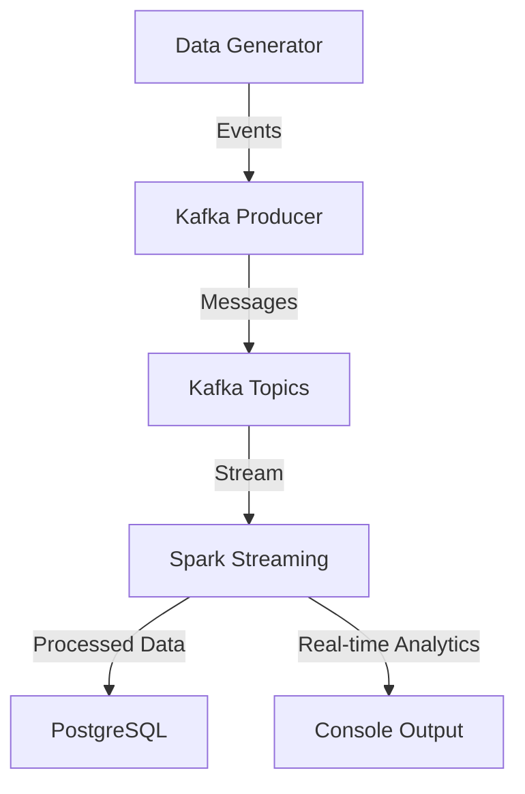

# E-commerce Real-time Analytics System

A real-time data processing system that analyzes e-commerce events using Apache Kafka, Apache Spark, and PostgreSQL.

## System Architecture



## Features

- Real-time event generation simulating e-commerce activity
- Stream processing of user behaviors and transactions
- 15-minute window analytics
- Persistent storage of events and analytics results
- Scalable architecture with Kafka partitioning
- Batch vs. Stream processing comparison

## Prerequisites

- Python 3.8.10
- Apache Kafka 3.3.1 (with Zookeeper)
- Apache Spark 3.3.0
- PostgreSQL 14.5
- Java 11 (OpenJDK 11.0.12)

## Installation

1. Clone the repository:
```bash
git clone <repository-url>
cd ecommerce-analytics
```

2. Create a virtual environment and install dependencies:
```bash
python -m venv venv
source venv/bin/activate  # On Windows: .\venv\Scripts\activate
pip install -r requirements.txt
```

3. Configure environment variables:
- Copy `.env.example` to `.env`
- Update the values in `.env` with your configuration

4. Set up PostgreSQL:
- Create a database user with appropriate permissions
- Run the database setup script:
```bash
python scripts/setup_database.py
```

5. Set up Kafka:
- Start Zookeeper and Kafka servers
- Create required topics:
```bash
python scripts/setup_kafka.py
```

## Project Structure

```
ecommerce-analytics/
├── src/
│   ├── data_generator/     # Simulated event generation
│   ├── kafka/             # Kafka producers and consumers
│   ├── spark/             # Spark streaming processors
│   └── database/          # PostgreSQL database handlers
├── scripts/               # Setup and utility scripts
├── config/               # Configuration files
├── tests/               # Test files
├── requirements.txt     # Python dependencies
└── README.md           # Project documentation
```

## Running the System

1. Start the real-time analytics system:
```bash
python src/main.py
```

2. Monitor the output:
- Check the console for real-time analytics results
- Query PostgreSQL for stored results
- Monitor Kafka topics using standard tools

## Event Types

### User Activity Events
- View product
- Search
- Add to cart
- Remove from cart

### Purchase Events
- Completed transactions
- Item quantities
- Payment information

### Inventory Events
- Stock updates
- Price changes

## Analytics

The system provides real-time analytics including:

1. User Behavior Metrics
- Product view counts
- Search patterns
- Cart abandonment rates
- User session analysis

2. Transaction Metrics
- Revenue per window
- Average order value
- Popular products
- Payment method distribution

3. Inventory Metrics
- Stock level monitoring
- Price change impacts
- Product performance

## Performance Monitoring

The system includes performance monitoring for:
- Event processing latency
- Throughput metrics
- Resource utilization
- Comparison of batch vs. stream processing

## Development

To contribute to the project:

1. Create a new branch for your feature
2. Implement your changes
3. Add tests for new functionality
4. Submit a pull request

## Testing

Run the test suite:
```bash
pytest tests/
```

## Troubleshooting

Common issues and solutions:

1. Kafka Connection Issues
- Verify Zookeeper and Kafka are running
- Check port configurations
- Ensure topics are created

2. PostgreSQL Connection Issues
- Verify database credentials
- Check database server status
- Ensure proper permissions

3. Spark Issues
- Verify Java installation
- Check memory allocation
- Review Spark logs

## License

This project is licensed under the MIT License - see the LICENSE file for details.
